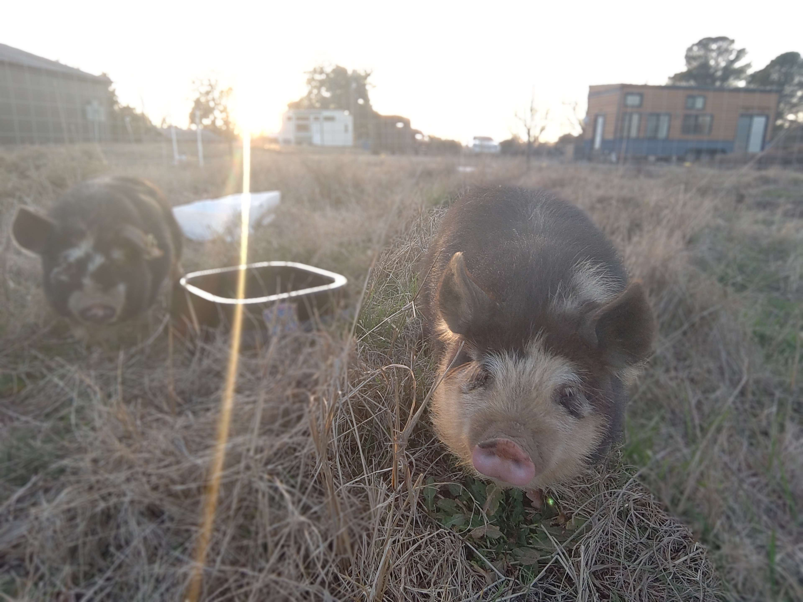

import "./_pig-pics.css";
import { CardGrid, Card } from "@astrojs/starlight/components";

Will and Barrow are anything but your everyday pigs. They've traveled all across the US, finding the best 2% milk in each town they pass. They love to sunbathe and roam the fields in Tony's new farm.

<CardGrid stagger>

<Card title="Milk mustache">

</Card>

<Card title="Pigs by the pipes">

</Card>

<Card title="Sunset" icon="sun">

</Card>

</CardGrid>
